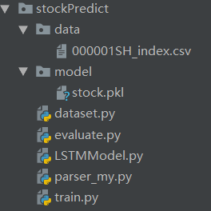

# stockPredict
pytorch实现用LSTM做股票价格预测

# 软件环境
python3.0以上，
pytorch 1.3.1，
torchvision 0.4.1, 
Pillow 7.1.2,
pandas 1.0.3

# 项目结构

data目录：上证指数的csv文件  
model目录：模型保存文件  
dataset.py : 数据加载及预处理类，数据标准化、划分训练集及测试集等  
evaluate.py : 预测  
LSTMModel.py : 定义LSTM模型  
parsermy.py : 常用参数  
train.py：模型训练

# 运行方法：

        直接运行train.py开始模型训练

        直接运行evaluate.py开始模型预测
